# aws-efs-shared-storage
Implementing Amazon EFS shared storage across multiple EC2 instances using NFS for scalable and highly available architecture.
# AWS EFS Shared Storage Across Multiple EC2 Instances


---
Mounting Amazon EFS across multiple EC2 instances to enable scalable shared storage using NFS.
Amazon EFS Shared Storage with Multiple EC2 Instances


## Introduction

In modern cloud environments, applications and websites often run on multiple servers. This is usually done for scalability, availability, and security reasons. Instead of relying on a single server, the workload is distributed across multiple instances.

However, when multiple servers are involved, a new challenge appears:

**How do these servers share the same files and storage?**

This is where **Amazon Elastic File System (EFS)** comes in.

Amazon EFS is a scalable network file system that allows multiple **Amazon EC2 instances** to access the same storage at the same time. This means different servers in the same infrastructure can read and write to the same filesystem simultaneously.

The benefit of this setup is reliability.

If one server fails or goes offline, the other servers can continue serving the application without interruption. This improves high availability and ensures that the system continues running even when individual components fail.

You might be wondering:

> What happens if someone gains access to the file system?

This is where AWS security features come into play.

Amazon EFS integrates with multiple layers of AWS security, including:

- Security Groups to control network access  
- IAM policies to control who can manage the file system  
- Access Points to enforce directory permissions and user identities  
- Encryption at rest and in transit to protect data  

These controls ensure that even though multiple servers share the same storage, access is still tightly controlled and secure.

In this project, we demonstrate how to create an Amazon EFS file system and mount it across multiple EC2 instances, allowing them to share the same storage in a secure and scalable way.

By the end of this lab, multiple servers will be able to **read and write to the same filesystem in real time**.

---

## Architecture Overview

```
                AWS Cloud
                   │
                   │
              Amazon EFS
         (Shared Network File System)
                   │
        ───────────┼──────────
        │                     │
   EC2 Instance          EC2 Instance
   webserver-01          webserver-02
        │                     │
        └────── NFS (2049) ───┘
```

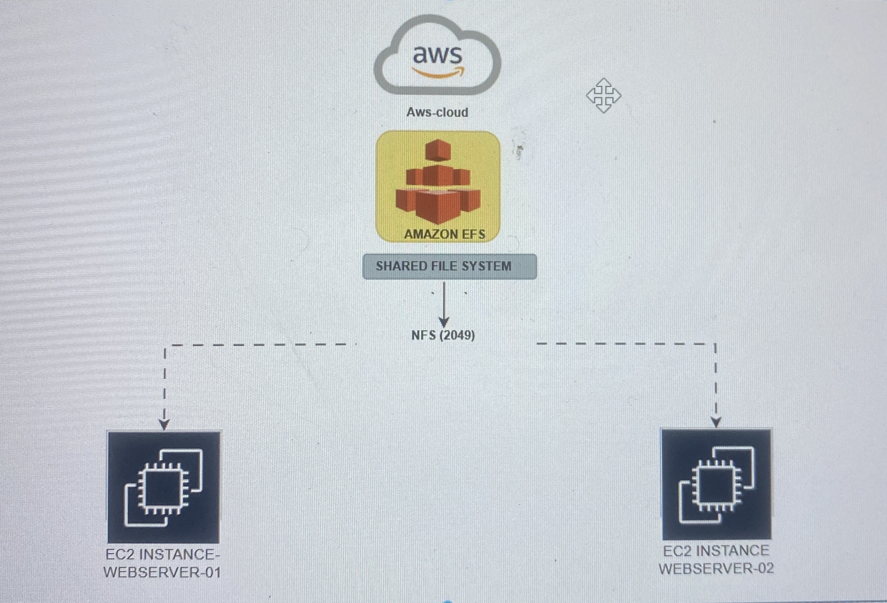

Both servers mount the shared filesystem at:

```
/mnt/efs
```

## Prerequisites

Before starting this project, ensure you have the following:

- Two EC2 instances
- Instances in the same VPC
- Security group allowing **NFS (TCP port 2049)**

## Step 1 — Sign in to AWS

Sign in to the AWS Management Console.

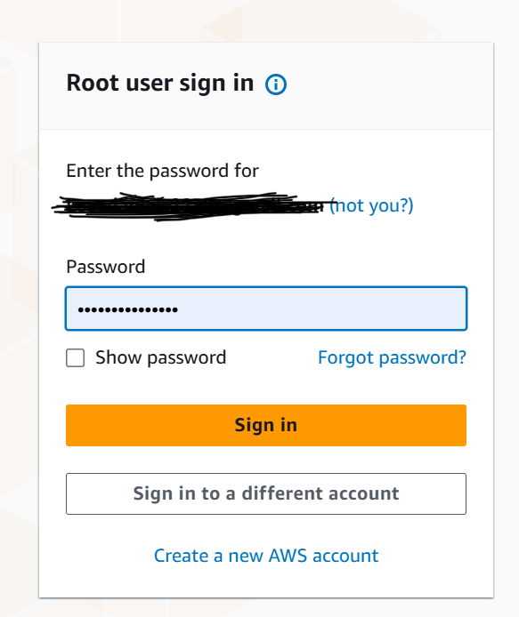

## Step 2 — Create Amazon EFS File System

Navigate to:

```
AWS Console → Elastic File System → Create File System
```
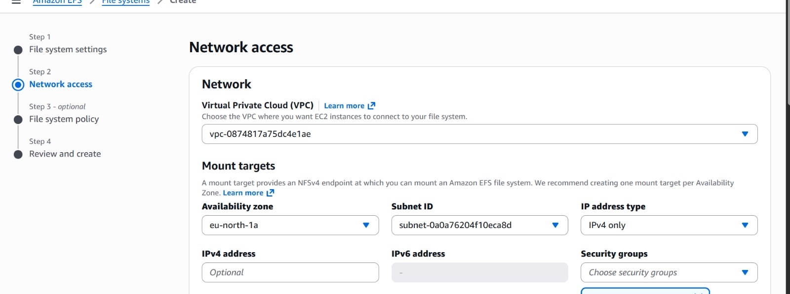

Configuration used:

| Setting | Value |
|-------|-------|
| Name | lovedigitals-efs |
| Performance Mode | General Purpose |
| Throughput Mode | Elastic |
| Encryption | Enabled |
| Automatic Backups | Enabled |

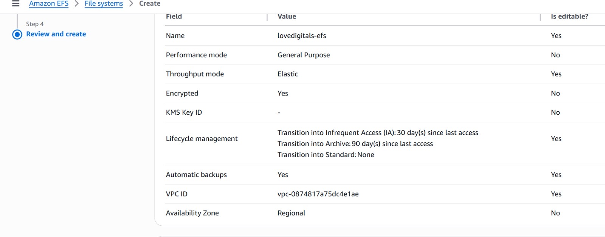

After creation, the file system appears in the console


## Step 3 — Configure Network Access

EFS requires mount targets inside the VPC.
![EFS Network Access Mount Targets]
Security groups must allow:

```
Protocol: TCP
Port: 2049
Source: EC2 Security Group
```
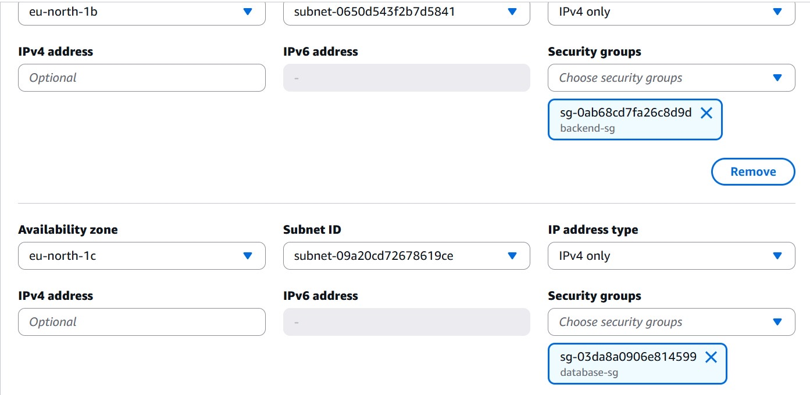

## Step 4 — Create an EFS Access Point

Access points enforce permissions and user identity when accessing the file system.

Example configuration:

```
Root Directory: /app-data
POSIX User ID: 1000
POSIX Group ID: 1000
```

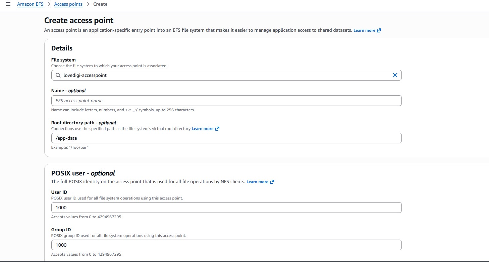


## Step 5 — Install NFS Client

Connect to both EC2 instances and install NFS utilities.

```bash
sudo apt update
sudo apt install nfs-common
```

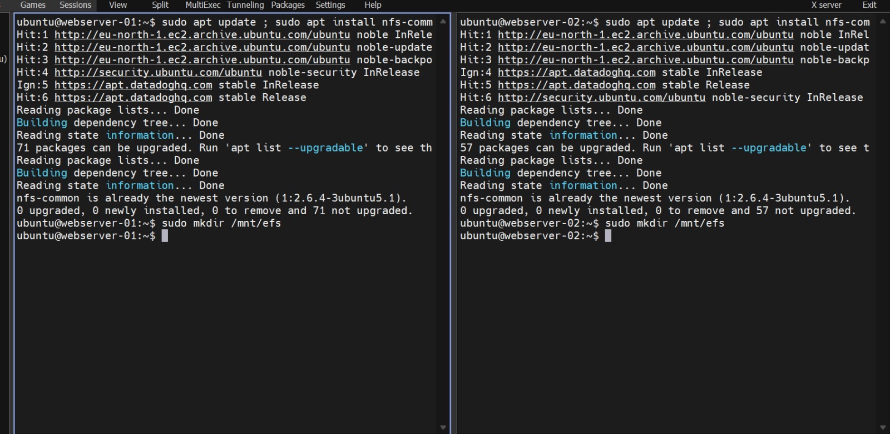

---

## Step 6 — Create Mount Directory

```bash
sudo mkdir -p /mnt/efs
```

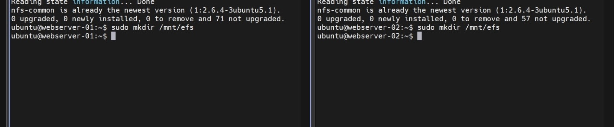

## Step 7 — Mount the EFS File System

```bash
sudo mount -t nfs4 -o nfsvers=4.1 fs-06cb0b5a5a1035ad2.efs.eu-north-1.amazonaws.com:/ /mnt/efs
```

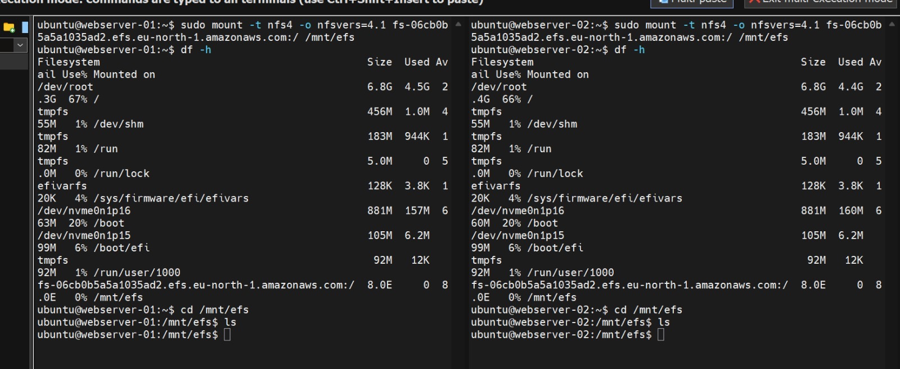


## Step 8 — Verify Mount

```bash
df -h
```

Expected output should show the EFS mounted on `/mnt/efs`.

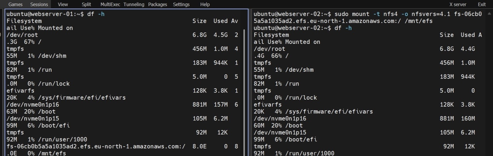

## Step 9 — Test Shared Storage

On **webserver-01**

```bash
touch love.txt
```

On **webserver-02**

```bash
ls
```

If the file appears, shared storage is working.

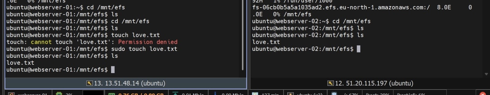

## Step 10 — Configure Automatic Mount

Edit the fstab file.

```bash
sudo nano /etc/fstab
```

Add:

```
fs-06cb0b5a5a1035ad2.efs.eu-north-1.amazonaws.com:/ /mnt/efs nfs4 defaults,_netdev 0 0
```

Test configuration:

```bash
sudo mount -a
```

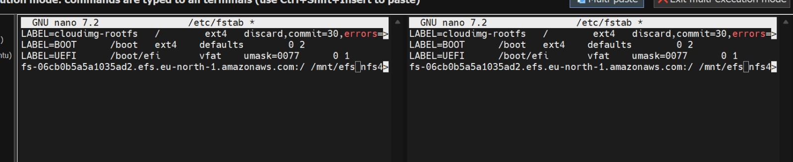


## Final Result

This project successfully demonstrates how to implement shared storage across multiple EC2 instances using Amazon EFS.

Capabilities achieved:

- Shared storage across servers
- Real-time file synchronization
- High availability architecture
- Automatic mounting after reboot

---

## Technologies Used

- AWS EC2  
- AWS EFS  
- Linux  
- NFS Protocol  
- AWS VPC  

---

## Author

**Love Daniel**  
Cloud & DevOps Engineer
